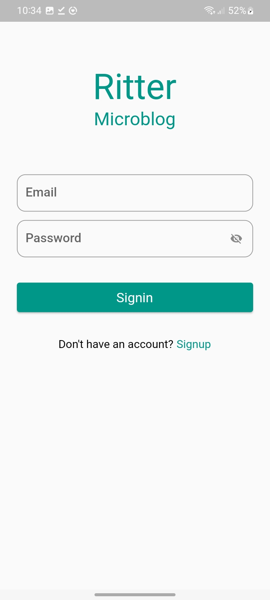
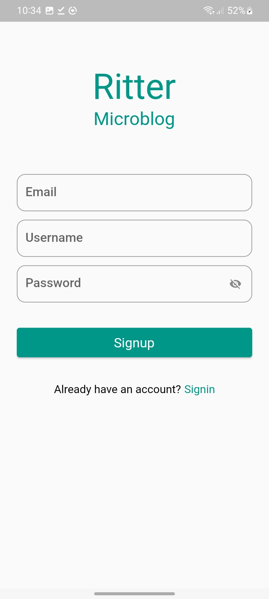
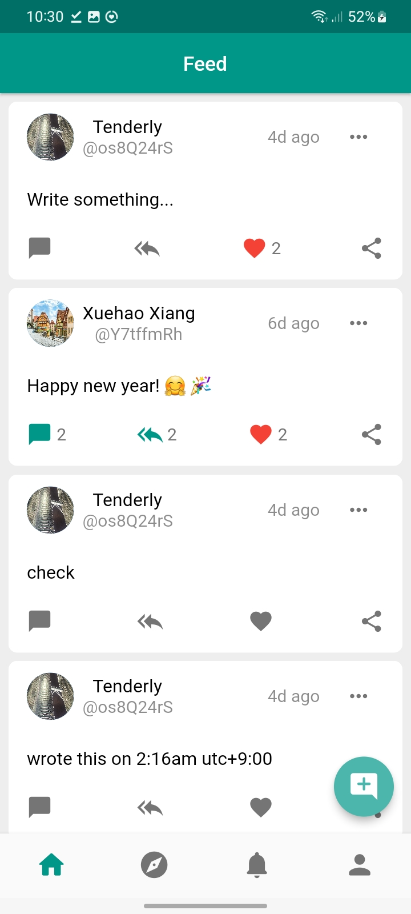
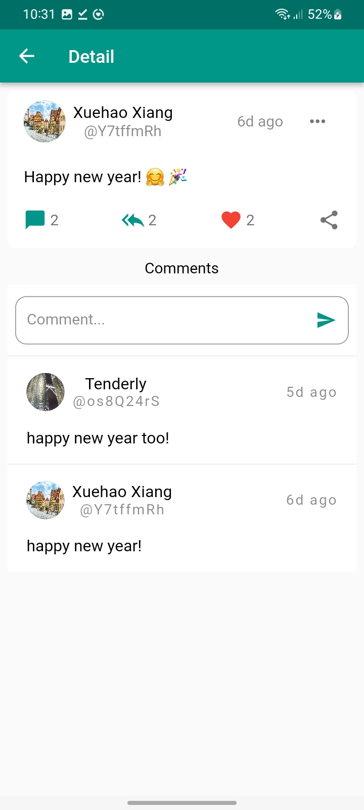
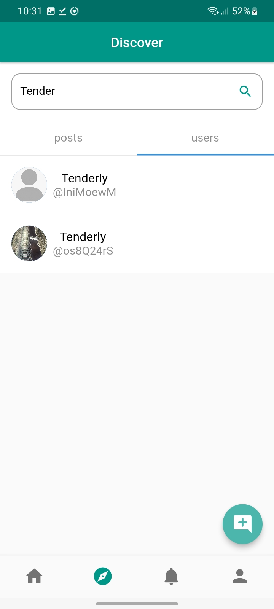
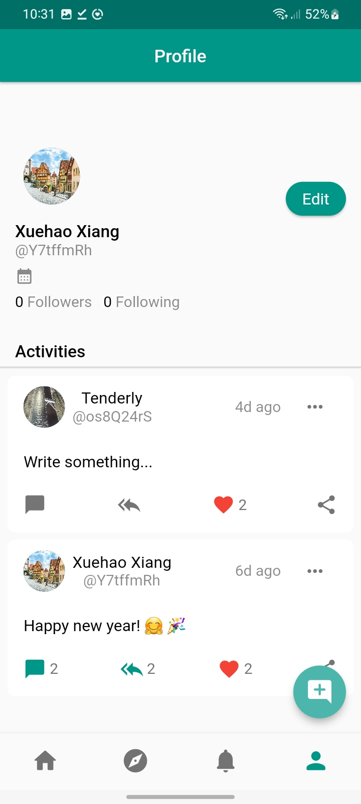
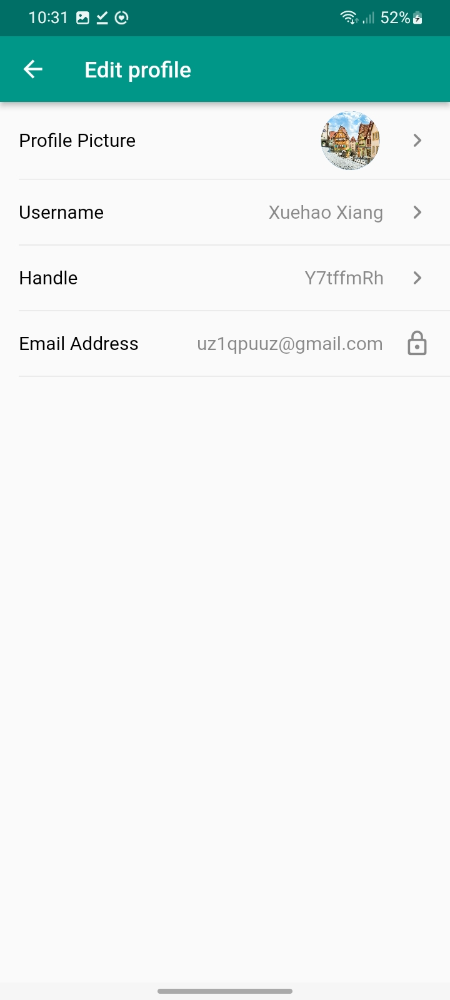

# ritter_microblog

A microblogging app built with Flutter and Firebase.

## Screenshots

### SigninScreen

<kbd></kbd>

### SignupScreen

<kbd></kbd>

### HomeScreen

<kbd></kbd>

### PostDetailScreen

<kbd></kbd>

### ExploreScreen

<kbd></kbd>

### ProfileScreen

<kbd></kbd>

### EditProfileScreen

<kbd></kbd>
